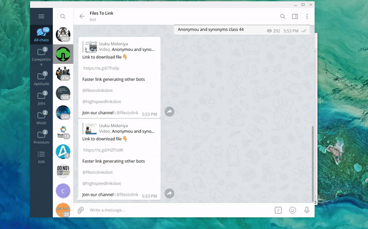

# Create direct links from @filestolink telegram bot generated links.

#### You can use this script to direct create links from @filestolink telegram bot generated links and later give feed to IDM, ADM etc.
1. Install **requests** using **pip**.
2. Forward all the files to @filestolink bot.
3. When the links are generated by the bot, select all the auto-generated messages as text.
4. Run the script in idle.
5. Paste all the selected messages into the idle shell.
6. Press Enter.
7. Press Ctrl+D.
8. Wait for the links to get generated.
9. Copy the generated links and feed them to IDM, ADM etc.

